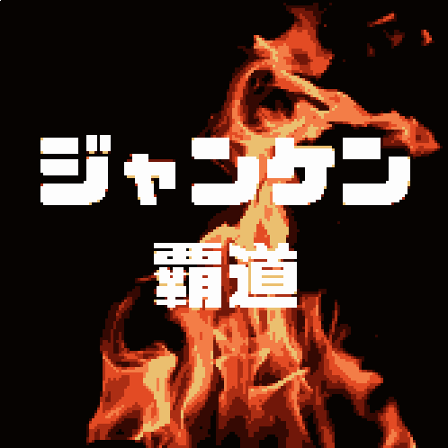
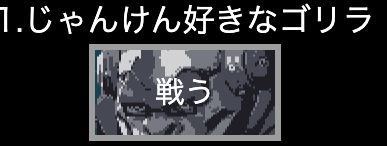
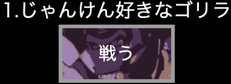
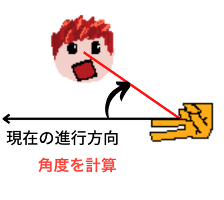

<!-- _backgroundColor: black
_color: white
-->

---

# 自己紹介

福岡 LAB8
江越正大(えごしせいだい)
あだ名は「えごさん」

---

# 課題のテーマは「じゃんけん」

昔ブラウザゲームでよく遊んだなぁ
フラッシュ倉庫とかも懐かしー

俺も、ゲーム作りたい！

---

# プレイ画面をお見せします！

---

# JavaScript で使った技術

- ### `canvas`

  html の`<canvas>`タグに JavaScript で描画を行う

- ### `setInterval()`

  繰り返し処理を行う

- ### `Math`
  乱数生成(`random`)、距離計算(`sin` `cos` `pow`)、角度計算(`atan2`)などで使用

---

# 超ざっくりゲームの仕組み

- 10msec 毎に描画、位置計算や当たり判定などの処理を行う
- 各ステージには wave があり、各 wave は敵の手の配列を持つ
- 1 つの手は`位置`,`スピード`,`角度`,`手の種類`の情報を持つ

---

# こだわりポイント

は沢山あるけど、
自己満足度の高いこだわりを紹介

---

# こだわりポイント 1

**ボタンにポインタをマウスを乗っけると**
**敵キャラが戦闘モードになる**

- ボタンを押すワクワク感がイイ！！！

---

# こだわりポイント 2

**相手の手が自分を追いかけてくる**
**(ホーミング)**

- 相手の手は角度とスピードで動くように
- 自分と相手の手の位置から角度を計算
- 相手の手は角度を小さくするように動く

**実装にとにかく時間がかかった**
**バグもたくさん出た**

---

# 未解決のバグもある

画面上から手がなくなったら終了にしたかった

手が残っていてもゲームが終了してしまう＼(^o^)／

---

# ありがとうございました！

github-pages で遊べまっす！

https://seidaiegoshi.github.io/Gs-janken-kadai/
